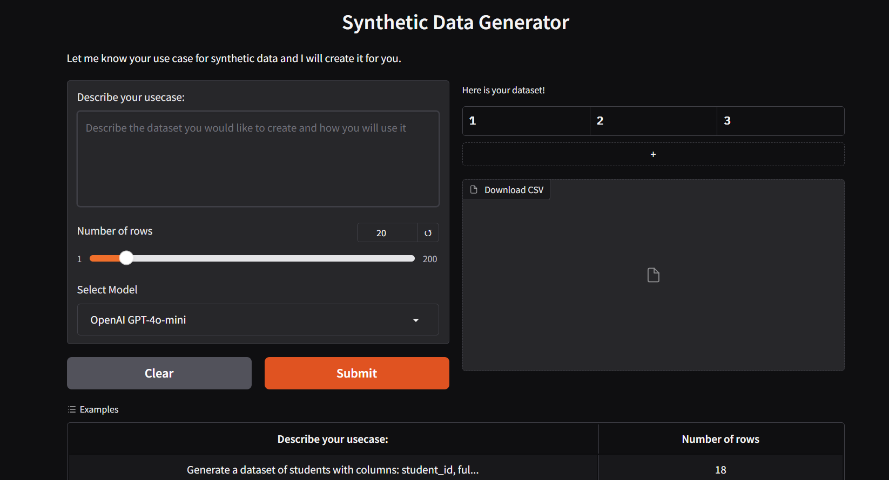
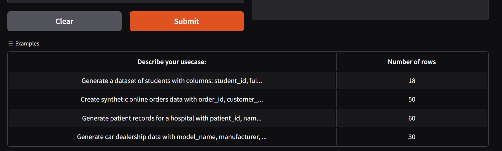
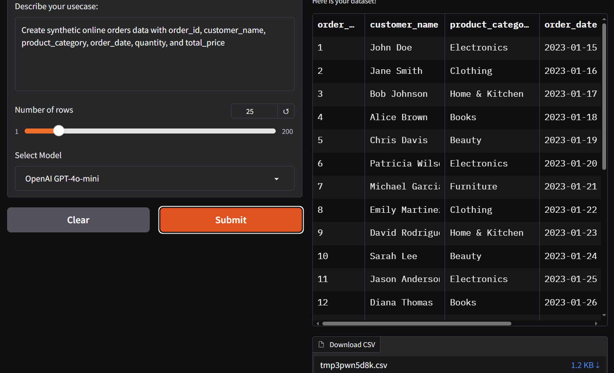

# Synthetic Data Generator

This is a **Gradio-based web application** for generating **realistic synthetic datasets** using **large language models**. Simply describe your use case and specify the number of rows—an LLM will handle the rest.

---

## Features

* 🧠 **Supports multiple LLMs**:

  * OpenAI GPT-4o-mini
  * Anthropic Claude 3.7 Sonnet
  * Google Gemini 2.0 Flash
  * *(Needs to be downloaded)* Meta LLaMA 3.1 8B-Instruct (open-source)

* **Displays generated data in a table**

*  **Download the result as a CSV file**

---

(The commented code is dedicated to use Llama, considered to be working. You need to have running **hf_token** in huggingface hub.)