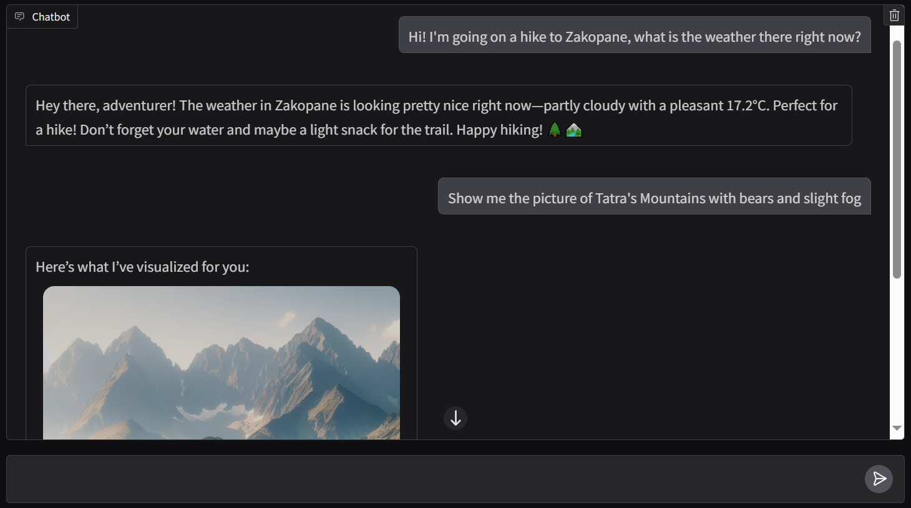

# 🥾 TrailMate — Your Friendly Hiking Assistant

**TrailMate** is an interactive, voice-enabled hiking assistant built with OpenAI’s GPT-4o-mini and Gradio. It helps users plan hiking trips, check weather, generate visualizations, and get gear recommendations — all with a friendly, adventurous tone.

---

## 🌟 Features

### 🧭 Conversational Hiking Assistant

* Built with `GPT-4o-mini` using a custom system prompt.
* Offers route planning, gear advice, and general hiking tips.
* Uses a light-hearted, trail buddy personality.

### ☁️ Weather Lookup Tool

* Real-time and forecasted weather data (up to 3 days ahead).
* Powered by [WeatherAPI](https://www.weatherapi.com/).
* Triggered automatically when the user asks about weather conditions.

### 🎨 Image Generation

* Visualizes hiking scenes and ideas using DALL·E 3.
* Requests like “show me a mountain campsite” automatically generate visuals.
* Returns base64-encoded images embedded in responses.

### 🔊 Text-to-Speech (TTS)

* Uses OpenAI's `tts-1` model to convert replies to natural speech.
* Audio is played locally using `pydub` + `ffplay`.


---

## 🚀 Running Locally

```bash
pip install -r requirements.txt
python app.py
```

Set up `.env` with the following keys:

```
OPENAI_API_KEY=your_openai_key
WEATHER_API_KEY=your_weatherapi_key
```

---

## 💡 Future Ideas (In process)

* Route finder (e.g. AllTrails integration)
* Voice input (speech recognition)
* Typing animation for more natural chat flow
